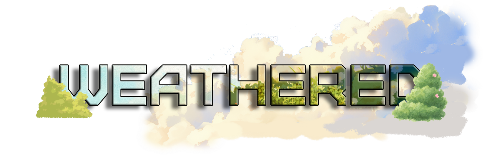
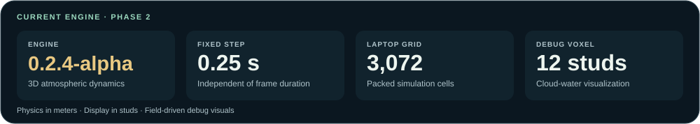
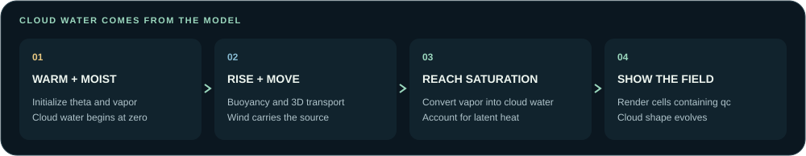
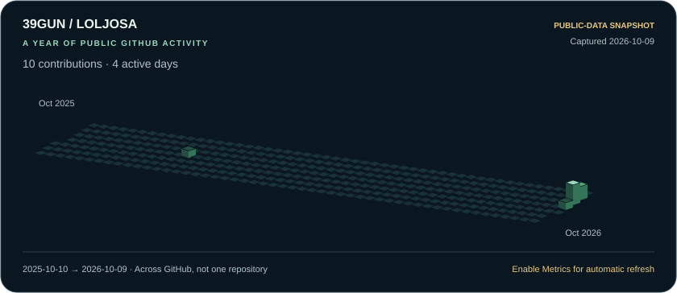

<p align="center">
  
</p>

<p align="center">
  <strong>Survival beneath a changing sky.</strong><br>
  A Roblox survival project with an atmosphere that evolves from the inside out.
</p>

<p align="center">
  
  
  
  <a href="https://github.com/Loljosa/WEATHERED-TESTBRANCH/commits/main"></a>
  <a href="LICENSE"></a>
</p>

<p align="center">
  <a href="#the-project">Explore</a> &nbsp;·&nbsp;
  <a href="#launch-the-atmosphere">Build &amp; run</a> &nbsp;·&nbsp;
  <a href="#take-control-of-the-sky">Cloud controls</a> &nbsp;·&nbsp;
  <a href="#development-activity">Activity</a> &nbsp;·&nbsp;
  <a href="#field-notes">Documentation</a>
</p>

---

## The project

**WEATHERED** is being built around a simple idea: weather should shape the world
you survive in. Wind, visibility, vegetation and future storms will share one
server-authoritative atmospheric field.

This repository develops the weather engine independently of the larger game.
The current **CM1-inspired warm-cloud prototype** runs natively in Luau. Clouds
begin as clear, warm/moist air; their water forms through saturation and
condensation. The visible voxels are a diagnostic view of that simulation.

<table>
<tr>
<td width="33%" valign="top">
<h3>Dynamic clouds</h3>
Warm/moist air rises, moves, condenses and evaporates. Cloud water starts at zero.
</td>
<td width="33%" valign="top">
<h3>A moving atmosphere</h3>
3D transport and live wind controls move the field. The source deforms as it evolves.
</td>
<td width="33%" valign="top">
<h3>A practical preview</h3>
Packed buffers, reusable storage and a Laptop preset keep the prototype focused.
</td>
</tr>
</table>

<p align="center">
  <picture>
    <source media="(max-width: 600px)" srcset="assets/readme/engine-at-a-glance-mobile.svg">
    
  </picture>
</p>

### From clear air to a cloud

<p align="center">
  <picture>
    <source media="(max-width: 600px)" srcset="assets/readme/cloud-lifecycle-mobile.svg">
    
  </picture>
</p>

**The field drives the visuals.** Future gameplay will sample atmospheric state
for wind, rain and visibility. Cloud Parts are a debug renderer, not gameplay
collision objects.

| Where the project stands | Current scope |
| --- | --- |
| **Implemented** | Warm-cloud phase conversion, latent heating, 3D transport, buoyancy and pressure projection |
| **Available in Studio** | Live wind, source shape/size, formation presets, playback, pause and reset |
| **Verified by CLI** | Production-module Lune tests and Rojo builds |
| **Next** | Studio profiling and sustained cloud development with explicit budgets |

## Launch the atmosphere

You need Git, Node.js/npm, [Rokit](https://github.com/rojo-rbx/rokit) and Roblox
Studio. The toolchain pins **Rojo 7.7.1** and **Lune 0.10.5**. Use the Rojo CLI;
the VS Code Rojo extension is unnecessary.

<details>
<summary><strong>Starting with a new checkout?</strong></summary>

```bash
git clone https://github.com/Loljosa/WEATHERED-TESTBRANCH.git
cd WEATHERED-TESTBRANCH
```

</details>

From your repository terminal:

```bash
rokit install
npm ci
mkdir -p build
rojo build default.project.json -o build/WEATHERED.rbxlx
```

Open the built place in Studio and choose **Run** to keep the editor camera.
This isolated test place has no terrain, floor or spawn. For an existing game
place, use **Play** and switch to the **server** view for controls.

1. Open **Output**. The Laptop preview starts clear; diagnostics print every ten
   wall seconds.
2. Look near **(0, 470, 0)**. The default cloud first crosses the visible threshold
   at **23.75 simulated seconds**: roughly 24 wall seconds at 1x if the server
   keeps up, plus up to one second of renderer delay.
3. Expand `Workspace.WEATHERED_DEBUG_VOXELS`, select a visible Part and press
   **F** to focus it.

<details>
<summary><strong>Prefer live sync?</strong></summary>

```bash
rojo serve default.project.json
```

Connect the [Studio Rojo plugin](https://rojo.space/docs/v7/getting-started/installation/)
to the CLI server. Studio must be able to reach the forwarded Rojo port when the
server runs in a Codespace. The Studio plugin is only needed for live sync;
building and opening a place works without it.

</details>

## Take control of the sky

During the test, select `ServerScriptService.Weather.WeatherServer`. In
**Properties → Attributes**, enter one command in **WeatherCommand** and press
Enter. The attribute clears after each command; **LastWeatherMessage** and
Output show the response.

| Try this | Result |
| --- | --- |
| `spawn Wide Fast` | Restart with a broad warm/moist source and faster formation conditions |
| `spawn Tower Fast` | Restart with a taller source; measured first visibility at 17 simulated seconds under 8/2 m/s wind |
| `wind 8 2` / `wind -8 -2` | Move or reverse the existing cloud with X/Z background wind, in physical m/s |
| `form 60` | Queue 60 seconds of real evolution at temporarily increased playback |
| `size 1.25` / `condensation Fast` | Restart with a larger source or faster warm/moist conditions |
| `speed 0.5` / `speed 1` | Reduce requested physics work or return to normal playback |
| `pause` / `resume` | Inspect a paused atmosphere or continue evolving |
| `reset` / `status` / `help` | Restart, inspect diagnostics or list commands |

**Spawn, size, condensation and reset replace the atmosphere.** Wind preserves
the existing cloud. Shape describes the starting source, not a rigid final cloud;
all sources begin with zero cloud water.

A preview sequence: **`spawn Wide Fast` → `wind 8 2` → `form 60`**.
Motion appears as changing occupancy of the fixed voxel grid. Faster playback
requests more CPU work and cannot guarantee faster wall-clock results.
See [Cloud controls](docs/cloud-controls.md) for every range and the server API.

## Inside the model

The physics uses packed float32 fields and reusable scratch buffers. Debug Parts
update at a lower frequency than physics; the simulation always uses a fixed
**0.25-second timestep**.

<details>
<summary><strong>Performance presets, display height and physical units</strong></summary>

| Setting | Laptop · default | Full · optional |
| --- | ---: | ---: |
| Grid, X × Y × Z | 16 × 12 × 16 | 24 × 12 × 24 |
| Cells | 3,072 | 6,912 |
| Physical spacing, X/Y/Z | 150/100/150 m | 100/100/100 m |
| Physical domain, X/Y/Z | 2,400/1,200/2,400 m | 2,400/1,200/2,400 m |
| Debug refresh | 1 Hz | 2 Hz |
| Maximum steps per Heartbeat | 1 | 2 |

Keep the Laptop preset for slower hardware. Change `PerformancePreset` while
stopped, then restart. Both presets have a soft **8 ms catch-up budget**: an
individual step can exceed it, and excess backlog is reported as dropped
simulation time. Native-host benchmarks do not establish Studio FPS.

Display cells are **12 × 12 × 12 studs**, spanning **Y424–568**. With terrain near
Y70, that is 354–498 studs above the terrain. `CloudBottomStuds` changes display
height without changing physical temperature, pressure or cell spacing.

Wind axes are **u=X, v=Z, w=Y**, in physical m/s. Roblox studs and atmospheric
meters are separate scales. Studio starts with a Round source at scale 1,
2/1 m/s wind, 6 K potential-temperature excess and RH 0.999. The core factory
retains its zero-wind, 2 K and RH 0.98 scientific defaults.

</details>

<details>
<summary><strong>Numerical architecture and current limits</strong></summary>

| Component | Implementation |
| --- | --- |
| State | Eight float32 buffers: `u`, `v`, `w`, `theta`, `qv`, `qc`, `qr`, `pressure` |
| Thermodynamics | Potential temperature, hydrostatic absolute pressure and liquid-water saturation |
| Microphysics | Coupled condensation/evaporation, latent heat and float32 water accounting |
| Momentum | Staggered MAC winds, buoyancy, drag and viscosity |
| Projection | Boussinesq pressure correction with residual and divergence checks |
| Transport | Bounded conservative finite-volume flux correction |
| Boundaries | Periodic X/Z; sealed top and bottom |

The model assumes constant density. Water diagnostics are unweighted mixing-ratio
sums, not density-weighted physical mass. Projection correction is separate from
absolute thermodynamic pressure. The coupled timestep remains first order.
Precipitation fallout, terrain feedback and sustained surface forcing are future
work. Detailed equations and diagnostic measurements live in
[Phase 2 dynamics](docs/phase2-dynamics.md).

</details>

## Validate a change

```bash
npx stylua src scripts tests
npx stylua --check src scripts tests
lune run scripts/test-atmosphere.luau --quick
rojo build default.project.json -o build/WEATHERED.rbxlx
git diff --check
```

The quick suite runs production modules for mathematics, transport, projection,
controls and bootstrap wiring. Use `--preview-only` for two 240-second preview
trajectories and a matched formation comparison; omit flags for the complete
six-scenario long-run matrix. Run `lune run scripts/benchmark-atmosphere.luau`
separately from expensive tests.

At `0.2.4-alpha`, focused validation passed **886,410 checks**; the quick suite
passed **72,458**. These are numerical and wiring checks. Graphics and gameplay
performance need the [manual Studio test](docs/phase2-dynamics.md#exact-studio-test).

## Field notes

| Guide | What you will find |
| --- | --- |
| [Cloud controls](docs/cloud-controls.md) | Source shapes, live wind, formation and measured moving-cloud behavior |
| [Laptop performance](docs/laptop-performance.md) | Presets, work limits, profiling and Studio settings |
| [Phase 2 dynamics](docs/phase2-dynamics.md) | Equations, boundaries, units, conservation and solver diagnostics |
| [Phase 1 reference](docs/dynamic-cloud.md) | The earlier vertical-only warm-cloud prototype |
| [Activity calendar setup](docs/readme-metrics.md) | Snapshot provenance and optional lowlighter/metrics automation |

<details>
<summary><strong>Repository map</strong></summary>

```text
assets/                   Branding and README visuals
src/
├── shared/Atmosphere/
│   ├── Core/             Geometry, staggered faces and packed state
│   ├── Thermodynamics/   Sounding, temperature conversion and saturation
│   ├── Microphysics/     Warm-cloud phase conversion
│   ├── Dynamics/         Momentum, projection and 3D transport
│   ├── Utilities/        State validation
│   ├── Simulation.lua    Simulation ownership and stepping
│   └── init.lua          Public atmosphere entry point
├── server/
│   ├── Simulation/       Fixed-step controller, presets and cloud controls
│   ├── Debug/            Pooled voxel visualization
│   └── WeatherServer.server.lua
└── client/
    └── WeatherClient.client.lua

docs/                     Physics notes and Studio instructions
scripts/                  CLI tests and benchmarks
tests/                    Production-module tests and Roblox lookup adapters
.github/workflows/        Optional activity-calendar refresh
```

</details>

## The next horizon

- [x] Establish a clear-air warm-cloud model with natural condensation.
- [x] Add conservative 3D transport and validated pressure projection.
- [x] Add moving-cloud controls and a smaller Laptop preview.
- [ ] Profile in Studio and improve transport/solver cost.
- [ ] Sustain cloud development through controlled surface forcing and budgets.
- [ ] Expose sampling services for existing survival gameplay systems.
- [ ] Add precipitation, terrain interaction and storm lifecycle.
- [ ] Develop field-driven client cloud rendering and LOD.

Core modules stay `--!strict`, with documented units, packed fields and reusable
storage. Changes should preserve working inventory, crafting, movement and world
systems while keeping simulation and rendering independent.

## Development activity

<p align="center">
  <a href="https://github.com/Loljosa"></a>
</p>

**39GUN · GitHub account: [Loljosa](https://github.com/Loljosa).** This calendar
covers account-wide GitHub contributions, not only WEATHERED commits.
The initial image is a dated public-data snapshot. The optional workflow replaces
it with a full-year [lowlighter/metrics](https://github.com/lowlighter/metrics)
isocalendar after you configure `METRICS_TOKEN`.
[Enable automatic refresh](docs/readme-metrics.md).

---

<p align="center">
  <strong>WEATHERED</strong> · Made for Roblox · Built in Luau<br>
  <a href="LICENSE">MIT License</a> ·
  <a href="https://github.com/Loljosa/WEATHERED-TESTBRANCH/issues">Issues &amp; feedback</a> ·
  <a href="https://github.com/Loljosa/WEATHERED-TESTBRANCH/commits/main">Development history</a>
</p>
